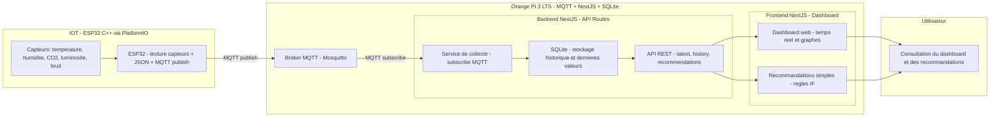
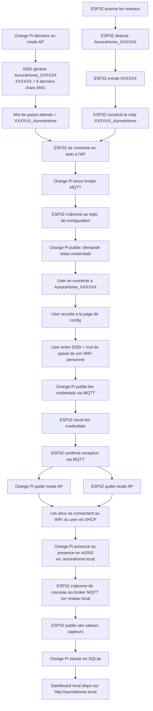

# T-ESP-AuroraHome

Firmware ESP32 — collecte multi-capteurs (CO2, temp, humidité, pression, luminosité, bruit) et publication MQTT vers un hub Orange Pi.

## Structure du dépôt

```text
.
├── platformio.ini    # build PlatformIO (env: esp32dev)
├── src/              # main.cpp
├── lib/              # libs internes (capteurs, fusion, net, telemetry)
├── include/          # config globale
├── test/             # tests Unity (native + embedded)
└── examples/         # bancs de test Arduino IDE isolés par capteur
```

## Build & flash

```bash
pio run -e esp32dev            # compile
pio run -e esp32dev -t upload  # flash
pio device monitor             # serial
```

## Architecture P.O.C



## Flux M.V.P. (provisioning)


