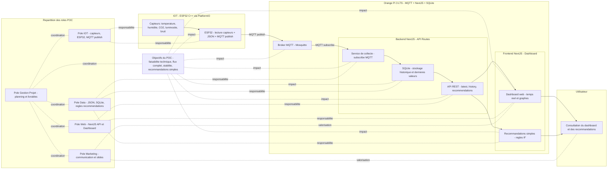
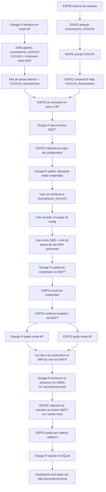

# AuroraHome

## P.O.C.

```mermaid
flowchart LR

%% ===== IOT / ESP32 =====
subgraph IOT[IOT - ESP32 C++ via PlatformIO]
    A1[Capteurs: temperature, humidite, CO2, luminosite, bruit]
    A2[ESP32 - lecture capteurs + JSON + MQTT publish]
end

%% ===== ORANGE PI =====
subgraph ORANGE[Orange Pi 3 LTS - MQTT + NextJS + SQLite]

    %% MQTT Broker
    B1[Broker MQTT - Mosquitto]

    %% Backend Next.js
    subgraph BACK[Backend NextJS - API Routes]
        B2[Service de collecte - subscribe MQTT]
        B3[SQLite - stockage historique et dernieres valeurs]
        C1[API REST - latest, history, recommendations]
    end

    %% Frontend Next.js
    subgraph FRONT[Frontend NextJS - Dashboard]
        C2[Dashboard web - temps reel et graphes]
        D1[Recommandations simples - regles IF]
    end
end

%% ===== Utilisateur =====
subgraph USER[Utilisateur]
    U[Consultation du dashboard et des recommandations]
end

%% ===== Flux principal =====
A1 --> A2
A2 -->|MQTT publish| B1
B1 -->|MQTT subscribe| B2
B2 --> B3
B3 --> C1
C1 --> C2
C1 --> D1
C2 --> U
D1 --> U

%% ===== Objectifs POC =====
P[Objectifs du POC - faisabilite technique, flux complet, stabilite, recommandations simples]

P -. impact .- A2
P -. impact .- B1
P -. impact .- B2
P -. impact .- B3
P -. impact .- C1
P -. impact .- C2
P -. impact .- D1

%% ===== Roles =====
subgraph POLES[Repartition des roles POC]
    direction TB
    PIOT[Pole IOT - capteurs, ESP32, MQTT publish]
    PWEB[Pole Web - NextJS API et Dashboard]
    PDATA[Pole Data - JSON, SQLite, regles recommendations]
    PGP[Pole Gestion Projet - planning et livrables]
    PMKT[Pole Marketing - communication et slides]
end

PIOT -. responsabilite .- A1
PIOT -. responsabilite .- A2

PWEB -. responsabilite .- C1
PWEB -. responsabilite .- C2

PDATA -. responsabilite .- B2
PDATA -. responsabilite .- B3
PDATA -. responsabilite .- D1

PGP -. coordination .- P
PGP -. coordination .- PIOT
PGP -. coordination .- PWEB
PGP -. coordination .- PDATA
PGP -. coordination .- PMKT

PMKT -. valorisation .- U
PMKT -. valorisation .- C2
```

## M.V.P.

```mermaid
flowchart TD

%% ======== ETAPE 1 : ORANGE PI EN MODE AP ========
A1[Orange Pi démarre en mode AP]
A2[SSID généré: AuroraHome_XXXXXX<br/>XXXXXX = 6 derniers chars MAC]
A3[Mot de passe attendu = XXXXXX_AuroraHome]

A1 --> A2 --> A3

%% ======== ETAPE 2 : ESP32 SE CONNECTE A L'AP ========
B1[ESP32 scanne les reseaux]
B2[ESP32 detecte AuroraHome_XXXXXX]
B3[ESP32 extrait XXXXXX]
B4[ESP32 construit le mdp XXXXXX_AuroraHome]
B5[ESP32 se connecte en auto a l'AP]
A3 --> B5

B1 --> B2 --> B3 --> B4 --> B5

%% ======== ETAPE 3 : HANDSHAKE MQTT AP ========
C1[Orange Pi lance broker MQTT]
C2[ESP32 s'abonne au topic de configuration]
C3[Orange Pi publie: demande relais credentials]
B5 --> C1 --> C2 --> C3

%% ======== ETAPE 4 : USER FOURNIT SES CREDENTIALS ========
D1[User se connecte a AuroraHome_XXXXXX]
D2[User accede a la page de config]
D3[User entre SSID + mot de passe de son WiFi personnel]
D4[Orange Pi publie les credentials via MQTT]
C3 --> D1 --> D2 --> D3 --> D4

%% ======== ETAPE 5 : CONFIRMATION ESP32 ========
E1[ESP32 recoit les credentials]
E2[ESP32 confirme reception via MQTT]
D4 --> E1 --> E2

%% ======== ETAPE 6 : TRANSITION VERS RESEAU USER ========
F1[Orange Pi quitte mode AP]
F2[ESP32 quitte mode AP]
F3[Les deux se connectent au WiFi du user en DHCP]
E2 --> F1 --> F3
E2 --> F2 --> F3

%% ======== ETAPE 7 : REDECOUVERTE SUR RESEAU LOCAL ========
G1[Orange Pi annonce sa presence en mDNS<br/>ex: aurorahome.local]
G2[ESP32 s'abonne de nouveau au broker MQTT sur reseau local]
F3 --> G1 --> G2

%% ======== ETAPE 8 : SYSTEME EN ROUTINE ========
H1[ESP32 publie ses valeurs capteurs]
H2[Orange Pi stocke en SQLite]
H3[Dashboard local dispo sur http://aurorahome.local]
G2 --> H1 --> H2 --> H3
```